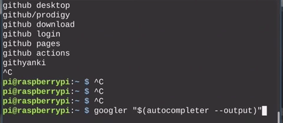

# autocompleter

A linux commandline web autocompleter
What it does: It scrapes autocompletes from duckduckgo, youtube and more and displays them. The user can then autocomplete and process the result.
## options
### --lang=xx-XX
sets the language to be autocompletion in. Defaults to en-US.
### --client=client
sets the client that is used for autocompleting. Defaults to duckduckgo. Valid options: google, youtube, yahoo, startpage, duckduckgo.
### --help
gives the user some help
### --exec=command
first method that can be used to process output. `{{{auto}}}` is replaced with the autocompleted string. example: `autocompleter --exec="echo 'autocompleted: {{{auto}}}'"`
### --output
Second method for processing output. Enables writing output to the stdout. Example: `echo "autocompleted: $(autocompleter --echo)"`
## use cases
It can be used within commands to for example search something.
## information about clients
### google
**currently broken**. More results and faster than duckduckgo. Sends requests directly to google servers.
### duckduckgo
Pretty fast, no privacy concerns, didn't break so far. Recommended.
### yahoo
more search results than duckduckgo, didn't break so far. Sends requests directly to yahoo servers.
### startpage
slow, no results before typing 3 letters. Not recommended.
### youtube
faster than duckduckgo, results more realated to videos. Sends requests directly to google servers.
## todo
- make google client work when there's an image url
- make backspace work
